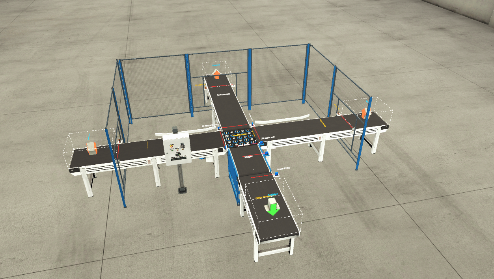

# CodeSys_Sorting_By_Weight
Plc program developed with **CodeSys** wiht **Structured Text** and a modular programming approach, to control a box sorting machine by weight with **FactoryIO** through and **OPC server**.
## Project Description
The process consist of **sorting boxes by their size** through a scale sensor placed underneath the "Load Scale Conveyor". There are three possible paths for the boxes to exit the process. 
Every box path depends on the **signal measured** by the scale sensor. Once the measurement has been read, a command will be sent to the "box selector" to guide them to their right path.

Small sized boxes will leave through the left side conveyor belt. Opposite to it, the medium sized boxes will find the way to exit the station by the right conveyor. Finally, the large sized boxes, 
will be sent straight forward throughout the front conveyor.

The process has been divided into five different **subprograms or subrutines** following the modular programming approach. Each subrutine is being called by "main" when necessary. 
Each program works independently from each other but obviusly there is main dependency.

The sorting process has two diffent "stopping modes". An **Emergency stop** and **Soft stop**.

- The **Emergency Stop** will stop all the plant and send the process to its initial state:

- On the other hand, the **Soft Stop** will send the system into a "pause" mode until the operator press the "Start Button" again and the process continues where it was left.

